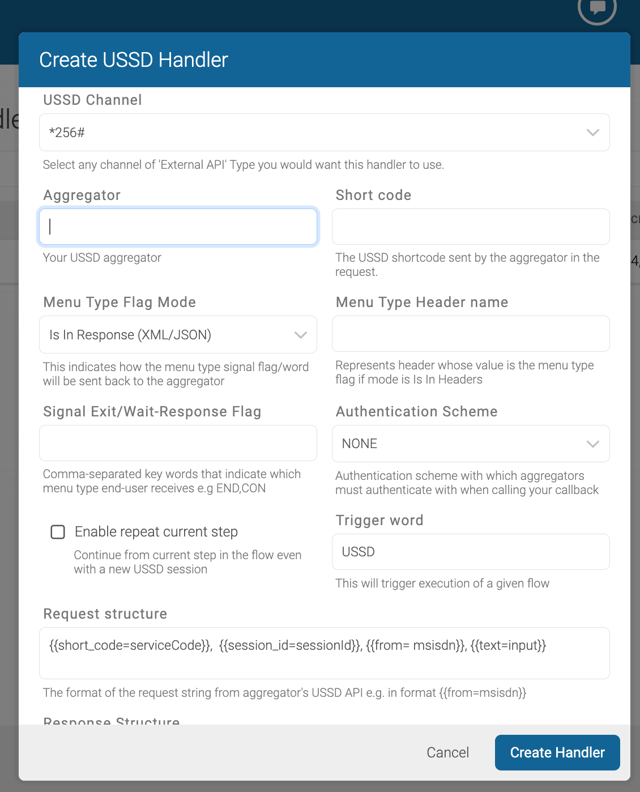

# RapidPro 

[](https://github.com/rapidpro/rapidpro/actions?query=workflow%3ACI) 
[](https://codecov.io/gh/rapidpro/rapidpro)

RapidPro is a hosted service for visually building interactive messaging applications.
To learn more, please visit the project site at http://rapidpro.github.io/rapidpro.

### Stable Versions

The set of versions that make up the latest stable release are:

 * [RapidPro v7.4.2](https://github.com/rapidpro/rapidpro/releases/tag/v7.4.2)
 * [Mailroom v7.4.1](https://github.com/nyaruka/mailroom/releases/tag/v7.4.1)
 * [Courier v7.4.0](https://github.com/nyaruka/courier/releases/tag/v7.4.0)
 * [Archiver v7.4.0](https://github.com/nyaruka/rp-archiver/releases/tag/v7.4.0)
 * [Indexer v7.4.0](https://github.com/nyaruka/rp-indexer/releases/tag/v7.4.0)
 * [Android Channel v2.0.0](https://github.com/rapidpro/android-channel/releases/tag/v2.0.0)
 * [Android Surveyor v13.9.0](https://github.com/rapidpro/surveyor/releases/tag/v13.9.0)

### Versioning in RapidPro

Major releases of RapidPro are made every four months on a set schedule. We target November 1st
as a major release (`v7.0.0`), then March 1st as the first stable dot release (`v7.2.0`) and July 1st
as the second stable dot release (`v7.4.0`). The next November would start the next major release `v8.0.0`.

Unstable releases have odd minor versions, that is versions `v7.1.*` would indicate an unstable or *development*
version of RapidPro. Generally we recommend staying on stable releases unless you
have experience developing against RapidPro.

To upgrade from one stable release to the next, you should first install and run the migrations
for the latest stable release you are on, then every stable release afterwards. If you are
on version `v6.0.12` and the latest stable release on the `v6.0` series is `v6.0.14`, you should
first install `v6.0.14` before trying to install the next stable release `v6.2.5`.

Generally we only do bug fixes (patch releases) on stable releases for the first two weeks after we put
out that release. After that you either have to wait for the next stable release or take your
chances with an unstable release.

### Versioning of other Components

RapidPro depends on other components such as Mailroom and Courier. These are versioned to follow the minor releases of 
RapidPro but may have patch releases made independently of patches to RapidPro. Other optional components such as the 
Android applications have their own versioning and release schedules. Each stable release of RapidPro details which 
version of these dependencies you need to run with it.

## Updating FlowEditor version

```
% npm install @nyaruka/flow-editor@whatever-version --save
```

### Get Involved

To run RapidPro for development, follow the Quick Start guide at http://rapidpro.github.io/rapidpro/docs/development.

### License

In late 2014, Nyaruka partnered with UNICEF to expand on the capabilities of TextIt and release the source code as 
RapidPro under the Affero GPL (AGPL) license.

In brief, the Affero license states you can use the RapidPro source for any project free of charge, but that any changes 
you make to the source code must be available to others. Note that unlike the GPL, the AGPL requires these changes to be 
made public even if you do not redistribute them. If you host a version of RapidPro, you must make the same source you 
are hosting available for others.

The software is provided under AGPL-3.0. Contributions to this project are accepted under the same license.


## Going about USSD support

Different aggregators send request with varying parameter names.
What we are sure of is the fact that they all send parameters with similar meaning
e.g., one might send `ussdServiceCode` and another as `ussdCode`

Therefore, We need a way to translate and map these to a single standard representation.

Using the aggregator handler logic added under ussd, you configure  a handler for each of your USSD 
aggregator with a request_structure field where you map 
these to system 
standard 
names.

For example, `{{from=msisdn, ussdServiceCode=short_code}}` means the aggregator will send `msisdn` but we
interpret and treat it as `from`. Likewise, `ussdServiceCode` is interpreted as `short_code`.
another aggregator handler can map them as `{{from=telNumber, serviceCode=short_code}}`.

The purpose of this function is to map these to the standard nomenclature.
The standard system nomenclature being 
```
[from, short_code, timestamp, session_id, text]
```

Note that a USSD gateway might send other parameters with a different meaning, but we did not see reason to support 
these for now.

### Handler Configuration

Note that this implementation of USSD relies on only pre-configured External API channel(s).
Ensure that you have one such type configured before you proceed with configuring a handler for your aggregator USSD 
gateway.



You will configure a separate handler for each USSD shortcode you intend to support.

On the top navigation menu, click `ussd` then click `Create USSD Handler`.

A dialog form similar to one in the image above will pop up.

Let's look at each of the fields on this form and what each does.

<table>
<tr>
<th>Field</th>
<th>Mandatory?</th>
<th>Description</th>
</tr>
<tbody>
<tr>
    <th>USSD Channel</th>
<td>YES</td>
    <td>This is a select field that allows you to configure a channel to be used by the handler. Only configured 
External API type channels will be visible here.</td>
</tr>
<tr>
<th>Aggregator</th>
<td>YES</td>
<td>This is the name of your USSD gateway provider or aggregator for which you are configuring this handler e.g. 
Africa's 
talking. 
It serves no technical importance, but we made it mandatory for good practice.
</td>
</tr>
<tr>
<th>Short Code</th>
<td>YES</td>
<td>This is the USSD shortcode sent by the aggregator in the request. This must be part of the request params sent 
by the aggregator USSD gateway. In 
case your aggregator does not send this, then we have a problem. Luckily you can configure a DEFAULT_SHORTCODE 
under settings and use this instead. but u can only configure one such handler.</td>
</tr>

<tr>
<th>Menu Type Flag Mode</th>
<td>YES</td>
<td>
This is a select field with the following options;
<ol>
<li><b>Starts With (Plain Text)</b> - Response is plain text but starts with a menu type flag key word</li>
<li><b>Ends With (Plain Text)</b> - Response is plain text but ends with a menu type flag key word</li>
<li><b>Is In Response(XML/JSON) </b>- Response is XML or JSON and one of the attributes  is a menu type flag</li>
<li><b>Is In Header(XML/JSON)</b>- Response is XML or JSON but one of the headers is the menu type flag</li>
<li><b>Is In Header(Plain Text)</b>Response is plain text but one of the headers is the menu type flag</li>
</ol>
Since we have to signal to the USSD gateway about which type of menu to render to the end user device.
The end user receives either a closing menu (which does not prompt a reply) or one that prompts a user to respond.
In order to achieve the above, different USSD Gateways require certain flags in the response.
We support a few common ones listed above.
Note that the next optional field is used to specify the header name whose value will represent the menu type flag
</td>
</tr>
<tr>
<th>Menu Type Header name</th>
<td>YES(if 4,6 above selected)</td>
<td>Once options <b>4</b> or <b>6</b> are selected above, this field becomes mandatory. This captures the header 
name whose value will represent the menu type flag</td>
</tr>
<tr>
<th>Signal Exit/Wait-Response Flag</th>
<td>YES</td>
<td>These are the actual flag values that inform the USSD gateway if the menu is a continuing of terminating 
one. Pardon the laziness here but kindly set them as comma-separated single words, the first one signals a 
terminating menu and the second a continuing e.g <code>END,CON</code> or<code> 0,1</code> or <code>false, true</code> or 
<code>STOP,
CONTINUE</code></td>
</tr>
<tr>
<th>Authentication Scheme</th>
<td>YES</td>
<td>This is a select field with that allows you select which form of authentication the USSD gateway will use while 
making USSD http requests to your callback request.
We currently support <code>token</code> and <code>basic auth</code> or <code>NONE</code>.
By default it is NONE, but we recommend you authenticate request to your callback.
</td>
</tr>
<tr>
<th>Enable repeat current step</th>
<td>NO (default is unchecked)</td>
<td>In a rare scenario where you want your current USSD session to pick from where the last one left off in the 
flow, please check this, e.g if you are taking a poll and the USSD session expires, check this and the users will 
pick from where they left of in the flow without triggering a flow restart.</td>
</tr>
<tr>
<th>Trigger word</th>
<td>YES</td>
<td>In future we shall select this from all configured triggers that start flows execution.</td>
For now, it is just a string corresponding to the trigger you set that starts a desired USSD flow.

Note that you must configure a trigger and link it to starting a flow then set its name here. Failure to do so will 
make this all logic fail since we use that trigger the first time a contact in a USSD session hits the channel. we 
send that trigger to tell rapidpro to start executing a given flow on this particular contact,
</tr>

<tr>
<th>Request structure</th>
<td>YES</td>
<td>
As described earlier, different USSD gateways name request parameters differently, this field allows you to map the 
these parameter names to the system standard names.

Below is the standard nomenclature of required (mandatory) request parameter names.
[`short_code`, `session_id`, `from`, `text`]. For example if your aggregator names these as follows;
[`serviceCode`, `sessionId`, `msisdn`, `input`].

Just map these as follows.
[`{{short_code=serviceCode}}`,  `{{session_id=sessionId}}`, `{{from=msisdn}}`, `{{text=input}}`]

Note that the USSD gateway might send more parameters in their request to our callback endpoint but we currently do 
not mind about the rest.
</td>
</tr>

<tr>
<th>Response Structure</th>
<td>YES (if option 3 or 4 of <b>Menu Type Flag Mode</b> is selected</td>
<td>
Just like the previous field, different USSD gateways require different response formats.
If <b>Menu Type Flag Mode</b> option  <b>3</b> or <b>4</b> is selected, that means that the response will be either 
XML or JSON. So, just like we did for incoming request parameters, map the system standard response parameter names to 
any USSD expected response params names.
The system standard response names are [<b>text</b> , <b>action</b>]
<ol>
<li><b>text</b> - This represents the menu string to be rendered at end user device</li>
<li><b>action</b> - This  represents the menu type (terminating or continue) to be rendered at end 
user device. Note that in cases where this flag is in headers, i.e if option 4 of <b>Menu Type Flag Mode</b> is 
selected, you can omit mapping the action at this level because it will have been takne care of by settings 
in <b>Menu Type Header name</b></li>
</ol>

For example, if USSD gateway A expects a response in the format;
`{"responseString":"Welcome to mobile banking select\n1.Login\n2.Register", "menuType":"continue"}`

Just map these as follows.
[`{{text=responseString}}`,  `{{action=menuType}}`]

</td>
</tr>
</tbody>
</table>

With these configurations, you can support different USSD gateways.
If yours is unique, feel free to reach out by opening a `pull request` or an `issue` for us to look into it and see how 
we can assist. 

You can still use the same SMS flows for USSD. Note that USSD supports not beyond 160 characters on some aggregators,
so try not to be too verbose while preparing your menus inside flows.

Below is the callback endpoint you have to share with your USSD gateway to configure as a callback URL

`https://your-domain/ussd/api/call-back`

Note that while configuring RapidPro's `External API` channel to use with the USSD handler, please set the SEND 
URL as `https://your-domain/ussd/api/send-url`.

Good luck.


